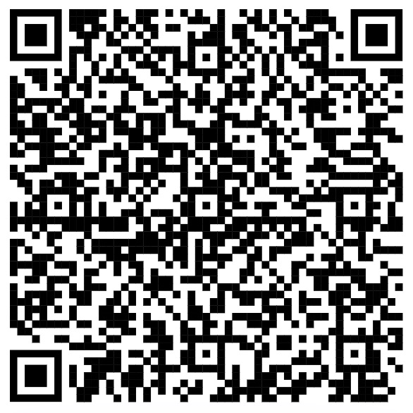

# WorkshoPythonSA

Este repositório contém os materiais utilizados no Workshop de Python da Semana Acadêmica da PUCRS de 2025.

---

## Notebooks

Os notebooks utilizados durante o workshop estão organizados na pasta `notebooks/`. Estão disponibilizados o notebook completo e o notebook com células para serem preenchidas.

---

## Materiais Adicionais

Além dos notebooks, os arquivos `constants.py` e `functions.py` incluem constantes e funções auxiliares utilizadas durante o workshop.

---

## QR Code:

---

## Links Úteis

- [Documentação Oficial do Python](https://docs.python.org/3/)
- [Real Python](https://realpython.com/)
- [W3Schools Python Tutorial](https://www.w3schools.com/python/)
- [Python Iluminado](https://pythoniluminado.netlify.app/)
